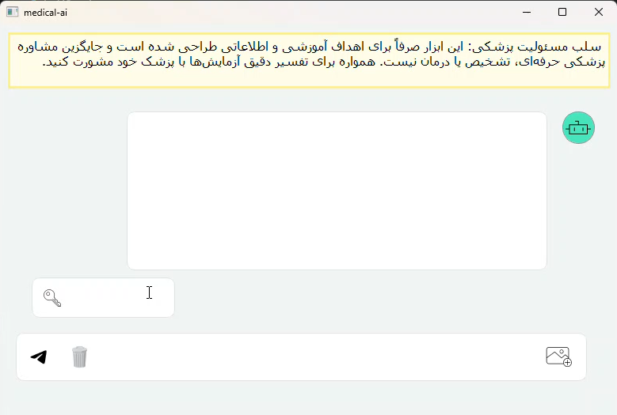

# blood-test-disease-prediction
AI-Based Disease Prediction from Blood Test Data

An AI-based application for predicting diseases from blood test data using a Random Forest machine learning model.

About the Project

This project uses machine learning techniques to analyze blood test data and predict potential diseases based on the available medical features.

The project includes a trained machine learning model, a user interface for interacting with the model, and the code used to train and run the system.

Technologies

Python
Scikit-learn
Pandas
NumPy
Random Forest
Machine Learning
pyqt5

Installation
Clone the repository:

git clone https://github.com/yasamanshoar/blood-test-disease-prediction.git
cd blood-test-disease-prediction
Install the required dependencies:
pip install -r requirements.txt

Usage
Run the main Python file:

python main.py
The application will launch the user interface and allow the trained model to process blood test data.

Project Structure

blood-test-disease-prediction/
├── README.md
├── requirements.txt
├── main.py
├── train.py
├── blood_disease_pipeline.pkl
├── blood_test_synthetic_dataset.csv
└── ui/
 ├── ui
 └── images/

User Interface

The project includes a graphical user interface for interacting with the trained machine learning model.

## User Interface

11:26
